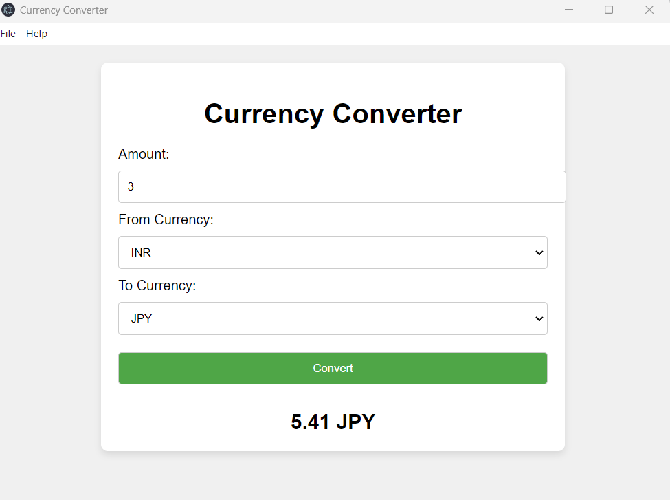

# 💰 Currency Converter

A simple and intuitive **Currency Converter** built with **Electron** and **JavaScript**. This application allows you to convert between different currencies using live exchange rates from a free API.

**Currency Converter** is a lightweight and user-friendly application that allows users to easily convert between major world currencies. The app fetches real-time exchange rates and performs conversions at the click of a button.

---

## 🔍 Key Features

- **Real-time Currency Conversion**  
  Convert currencies using up-to-date exchange rates from the [FreeCurrencyAPI](https://freecurrencyapi.com).

- **User-Friendly GUI Interface**  
  Built using **Electron**, it provides a smooth and intuitive interface for currency conversion.

- **Support for Multiple Currencies**  
  Convert between a variety of major currencies, including USD, EUR, GBP, INR, JPY, and more!

- **Conversion History**  
  View the result of each currency conversion, including the input amount and converted amount.

- **Open-Source Project**  
  Fully transparent and open for contributions under the **MIT** license.

---

## 📝 Table of Contents

1. [Usage](#-usage)  
2. [Features](#-features)  
3. [Contribution](#-contribution)  
4. [License](#-license)  
5. [Contact](#-contact)  

---

## 🚀 **Usage**

To run the application:
### Windows 
Please use this link to download [Setup](https://github.com/manxlr/currency-converter/releases/download/v1.0.0/Currency.Converter.Setup.1.0.0.exe)
### Source Code
1. Clone or download the repository.
2. Install the dependencies by running the following command in your project directory:
   ```bash
   npm install
   ```
3. Start the application using:
   ```bash
   npm start
   ```
4. A GUI window will open, allowing you to enter the amount to convert, select the source and target currencies, and view the converted result.



---

## 🛠️ **Features**

- **Currency Conversion**: Convert between major currencies using live exchange rates.
- **Real-time Fetching**: The app fetches the latest exchange rates from the FreeCurrencyAPI.
- **Simple User Interface**: The app has an intuitive interface with dropdown menus for currencies and a text box for the amount.
- **Error Handling**: The app provides proper feedback in case of errors (e.g., invalid amount, API errors).

---

## 🤝 **Contribution**

We welcome contributions! If you have any improvements, bug fixes, or new ideas, feel free to contribute to the repository:

- Fork the repository.
- Create a new branch.
- Submit a **Pull Request** with a detailed description of your changes.

### Repo Link: [https://github.com/manxlr/currency-converter](https://github.com/manxlr/currency-converter)

---

## 📜 **License**

This project is licensed under the **MIT License**, allowing you to freely use, modify, and distribute the code.

[MIT License](https://opensource.org/licenses/MIT)

---

## 📧 **Contact**

For any questions, suggestions, or feedback, please reach out:

- **Email**: [nszeeshankhalid@gmail.com](mailto:nszeeshankhalid@gmail.com)
- **GitHub**: [https://github.com/manxlr](https://github.com/manxlr)

---

### 🔗 **Links**

- [FreeCurrencyAPI Documentation](https://freecurrencyapi.com)
- [GitHub Repository](https://github.com/manxlr/currency-converter)

---

## 💖 **Donations**

If you find this project helpful and would like to support its continued development, you can donate using the following cryptocurrency addresses:

- **Ethereum (ETH)**: `0x23774348bc491Ff70F39c63f39B0e542a59b5B14`  
- **Bitcoin (BTC)**: `bc1qp7wltg8frvecuujjs9f3ck28r0s0h0qzld2fu6`  
- **Dogecoin (DOGE)**: `DTbwxMs4wenN2kUea77rHPQ8nbJrSk4o7D`  

Your support is greatly appreciated and helps maintain and improve open-source projects!

---
